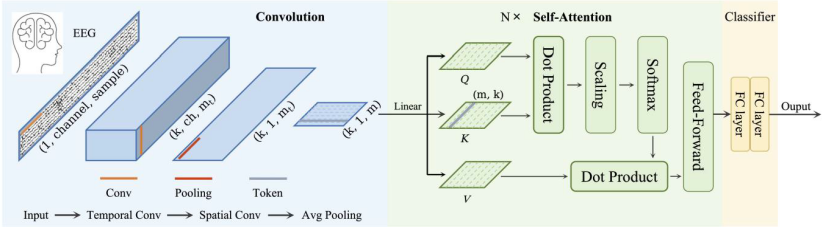
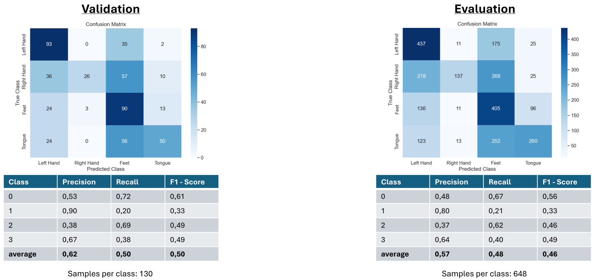

# Convolutional Transformer for EEG Decoding

This project implements a hybrid Convolutional-Transformer deep learning model in PyTorch to classify motor imagery tasks from EEG signals. The model is trained and evaluated on the BCI Competition IV Dataset 2a.



## Introduction

Brain-Computer Interfaces (BCIs) allow for the control of devices using brain activity alone. A key component of BCIs is the ability to interpret motor imagery—the imagined movement of a limb. This project tackles the challenge of classifying four different motor imagery tasks (left hand, right hand, feet, and tongue) from noisy, non-stationary EEG data.

## Dataset

This model uses the **BCI Competition IV Dataset 2a**, which can be found [here](https://www.bbci.de/competition/iv/#dataset2a).

*   **Subjects:** 9
*   **Tasks:** 4-class motor imagery
*   **Data:** 22 EEG channels and 3 EOG channels

Please download the dataset and place the preprocessed `.npy` files in the `data/` directory.

## Installation

1.  **Clone the repository:**
    ```bash
    git clone https://github.com/your-username/eeg-motor-imagery-transformer.git
    cd eeg-motor-imagery-transformer
    ```

2.  **Create a virtual environment and install dependencies:**
    ```bash
    python -m venv venv
    source venv/bin/activate  # On Windows, use `venv\Scripts\activate`
    pip install -r requirements.txt
    ```

## Usage

### Training the Model

To train the model from scratch, run the `train.py` script:
```bash
python src/train.py
```The script will perform the 80/20 train/validation split, train the model, and save the best-performing weights to the `saved_models/` directory.

### Evaluating the Model

To evaluate the trained model on the official evaluation set, run:
```bash
python src/evaluate.py --model_path saved_models/EEGModel.pth
```

## Results

The model achieves high training accuracy but shows signs of overfitting, with a final evaluation accuracy of approximately **46-50%**. The primary challenge is generalizing from a small dataset.

**Performance on Evaluation Set (with Early Stopping):**



**Training & Validation Curves:**
*(Add the plots for loss and accuracy over epochs)*

The model performs well on `left hand` and `right hand` classes but struggles to differentiate `feet` and `tongue` classes, which is a common challenge with this dataset.

## Future Work

To improve generalization and combat overfitting, the following steps are proposed:
*   **Enhanced Data Augmentation:** Implement techniques like adding Gaussian noise and temporal shifting.
*   **Expand Dataset:** Incorporate other publicly available BCI datasets or generate synthetic EEG signals using Generative Adversarial Networks (GANs).

## References
*   Song, Y., Zheng, Q., Liu, B. and Gao, X., 2023. "EEG Conformer: Convolutional Transformer for EEG Decoding and Visualization." *IEEE TNSRE*.
*   BCI Competition IV Dataset 2a description.
